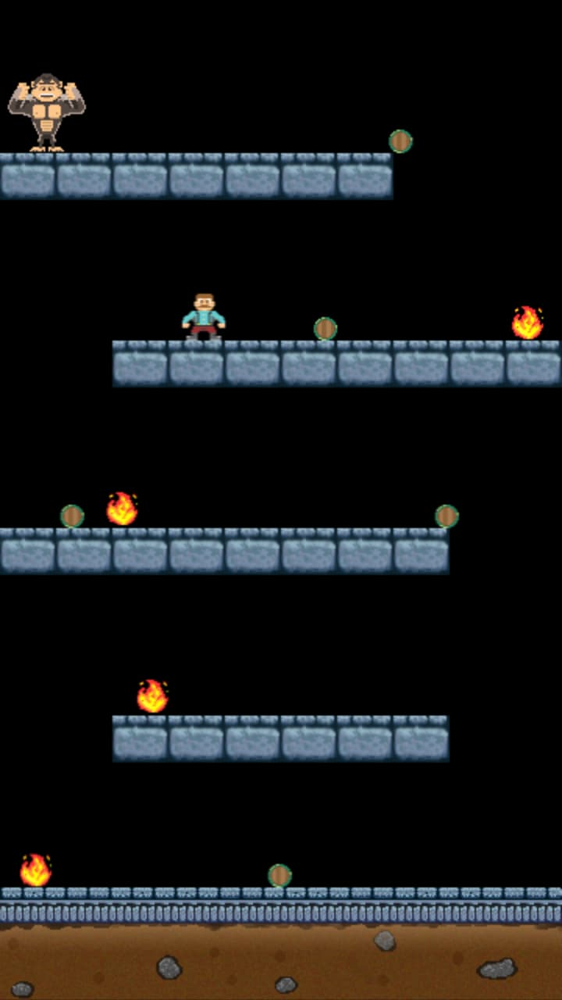
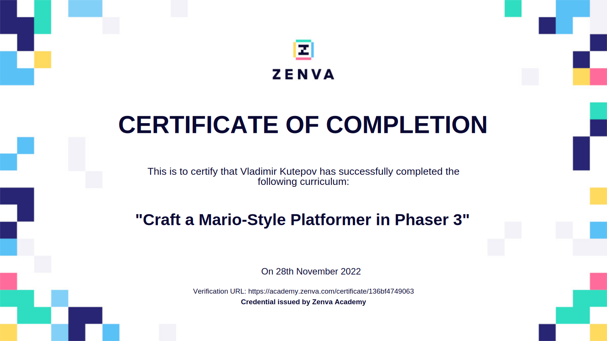

# Mario-Style Platformer Game

Zenva Course URL: https://academy.zenva.com/course/craft-a-mario-style-platformer-in-phaser-3/

HTML5 game framework Phaser: https://phaser.io/

[Click here](https://frenzzy.github.io/edu-game-phaser3-mario-style-platformer/public/) to play Mario-Style Platformer game:

[Click here](https://academy.zenva.com/certificate/136bf4749063) to see the certificate of completion:

